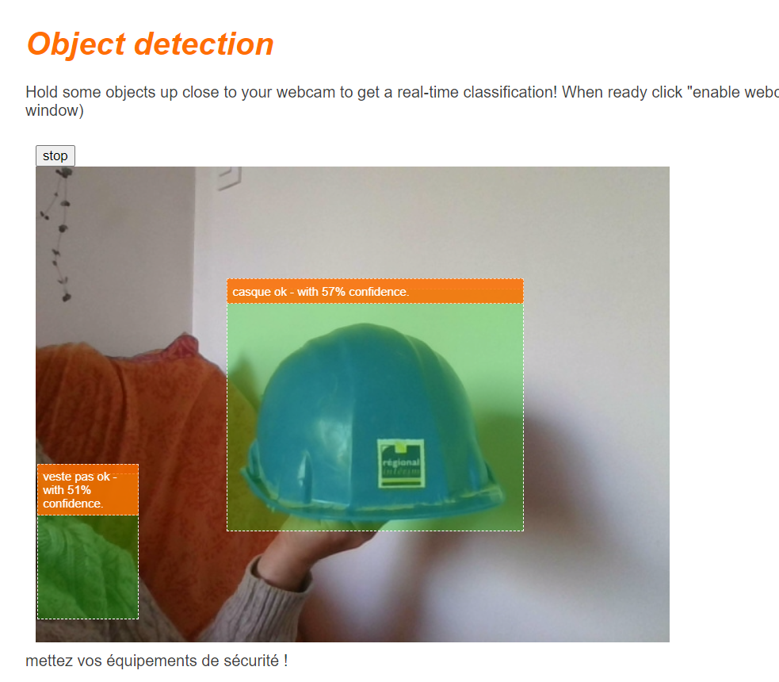

# détection d'équipements de sécurité avec TensorflowJS 




Un modèle est entraîné en python avec YoloV5 par transfer learning afin d'identifer le port d'un casque de chantier ou d'une veste de sécurité, puis exporté au format tensorflow.js : 

``` bash
python export.py --weights yolov5s.pt --include tfjs
```

Les fichiers exportés sont ensuite placés dans le dossier public/yolo. Il est possible d'utiliser un autre model au format tensorflow.js en plaçant le .json et les .bin à la place à la place de ceux présents dans le dossier public/yolo.   

Le modèle actuel comprend quatre labels, il faut alors renseigner les nouveaux labels dans le fichier public/cam.js. Quelques lignes de codes qui servent à afficher un texte supplémentaire peuvent être supprimées, suivre les indications dans le fichier public/cam.js et dans le fichier views/index.ejs.  

La détection se fait côté client, nodeJs avec Express est uniquement utilisé pour propulser les pages web et permettre de charger le modèle. Il n'y a donc aucune donnée collectée par le serveur.  

L'installation, qui nécessite d'avoir NodeJs et npm installés, se fait avec la commande

``` bash
npm install
```

El le programme se lance avec 

```bash
nodemon index.js
``` 

Il suffit ensuite de se rendre à cette adresse : 

> http://localhost:8080/